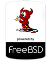

## SOFTWARE DOCUMENTATION

### System Requirements

* Java 8 (jdk1.8.0_25)
* Apache Maven (3.2.5 or Higher)
* MySQL (5 or Higher; Only for production mode)

To Cloning or Updating Software:

* Git (2.3 or Higher)

## Welcome to Balero CMS Enterprise.

### About this project

Balero CMS Enterprise is a Lightweight, Clean and Ultra-Fast Content Management System.
It uses Java Back-End for MVC Controllers and AngularJS Front-End for the API REST Services.

### Get Started

Cloning project:

    $ git clone https://github.com/neblina-software/balerocms-enterprise.git

Navigate to root folder and set read/write permissions:

    $ sudo chmod -R 777 balerocms-enterprise
    $ cd balerocms-enterprise
    
Choose Release:

    $ git checkout $CHOOSE_ONE_TAG
    
Where $CHOOSE_ONE_TAG is a tag release.
    
Available tags and releases reference:

[https://github.com/neblina-software/balerocms-enterprise/tags](https://github.com/neblina-software/balerocms-enterprise/tags)

And then, run:

    $ mvn test
    
### Development Deploy:

For testing, development and demo purposes. (H2 Memory-RAM Database)

    $ mvn spring-boot:run

If having troubles, then type:

    $ mvn -Pdev spring-boot:run

It will activate the development profile.
    
### Production Deploy:

For live portals and production (MySQL) with resource minification (HTML/CSS/JS).
First you need a MySQL Database called 'balerocms_enterprise'.

    $ mvn -Pprod spring-boot:run
    
Note: Make sure your MySQL Server is running on port 3306.

    telnet localhost 3306
    
See **Changing Authentication For Production Database**.

Congratulations!, you successfully installed Balero CMS EE.
Open http://localhost:8080/ in your favourite browser.

### Updating Software

    $ cd balerocms-enterprise
    $ git pull
    $ git checkout NEW_VERSION
    
Note: If you edited some files, execute this command after git checkout:

You can either commit your changes before you do the merge, or you stash them:

    $ git stash
    $ git merge origin/master
    $ git stash pop

Be sure, your db/migrations are added successfully. It will be executed automatically.

    Execute Command:
    $ mvn test -P prod

See **Database Repair/Migration Tool**.
    
#### Minification For Production Mode

Minification (also minimisation or minimization), is the process of removing all unnecessary
characters from source code without changing its functionality. These unnecessary characters 
usually include white space characters, new line characters, comments, and sometimes block 
delimiters, which are used to add readability to the code but are not required for it to execute.

If you activate it, you website will be load faster.

It will be load automatically when you execute with production profile:

To enable/disable edit in "config/":

    balerocms-minification: true or false

## QuickStar Guide

To login to your administrator panel:

http://localhost:8080/admin/dashboard (Hidden link)

And login with the sample data:

* admin:admin

To login to user's dashboard panel:

http://localhost:8080/user/dashboard (Public link)

And login with the sample data:

* user:user

**Note: In a live website, please delete 'user' account and change your admin password**.

## Configuration

### Finding configuration folder

In **src/main/resources/config**, all user'sconfiguration live there.

### Changing Authentication For Production Database

Edit:

* "application-prod.properties" in resources folder.

1. db.host = Host
2. db.name = Database Name
3. db.user = Add you MYSQL DB username.
4. db.password = Add your MYSQL DB password.
        
Note: Usually "root" and "".

All Done!

**Notes Only For Developers and/or  Advanced Options**:

Balero CMS EE use a database called "balerocms_enterprise" on "localhost" (127.0.0.1) and MySQL port: 3306.
If you need to change these values you may need to edit:

### Configuring Default Server Port

Default server port is: 8080. To use different port edit **application.properties** -> server.port.

### Configuring E-Mail Newsletter (SMTP Client)

Edit **application.properties** under resources folder, set your credentials
for you email account.

## Unit Testing

Unit tests will be run in Development Mode (In-Memory Database), you can find this configuration in: "config/".

### Running Unit Tests with MySQL

Sometimes you need debug a real database, or just want to analyze fields. To do this edit
application-prod.properties. 
            
Usually "root" and "".        

Then run:

    $ mvn test -P prod
    
### Database Repair/Migration Tool

If you updated your software and/or mysql/db has been changed, or
if you get a database error migration, you can fix with:

    Repair Command:
    $ mvn compile flyway:repair -P prod
    
    Migration Command:
    $ mvn compile flyway:migrate  -P prod

See **Changing Authentication For Production Database**.

## Hot Swap

Balero CMS provides a way to develop and make changes in real time application after
your application is compiled and/or running. After editing a Java Class, HTML Resource, etc:

    $ mvn compile
    
Note: In IntelliJ you need to check "Reload changes after compillation > Always".
    
### Bower Components

To install/update your javascript libraries, use:

$ bower install

It will be downloaded in resources folder **/static/bower_components**.

## Security Bugs / Reports

Tested with Mantra WebBrowser. If you found a bug. Please, notify us.

### Responsive Content

For Homepage Blocks, Page Content and Section Content.

Add fluid containers before insert rich text content (Source Code Mode), example:

> &lt;div class="container-fluid"&gt;

> &lt;div class="row"&gt;

> ...

> &lt;/div&gt;

> &lt;/div&gt;
 
Please, read the Bootstrap CSS documentation:

[http://getbootstrap.com/css/](http://getbootstrap.com/css/)

### Database Changelog Timestamps

In **db/migration** folder Timestamps Convention:

V-YEAR-MONTH-DAY.HOUR-MINUTES-SECONDS__Message.sql

Example:

V-20150107.010600__Message_example_etc.sql

Version Control Convention:

V1.0__Message_example_etc.sql

### Internationalization

You can choose the main language for you content from Dashboard.

Go to **Global Settings > Main Language**.

### Image Gallery

Adding image gallery in content use:

    

        

            
            
            
        

    

    
### Template System

Balero CMS use ThymeLeaf as template engine, and extends it with AngularJS.

Using template engine. Inside "resources/templates".

Template Structure:

    /
    +- src/
       +- main/
          +- resources/
              +- templates/
                 +- $TemplateName
                    +- css
                    +- images
                    +- fragments
                        +- header.html
                        +- footer.html
                        +- mavbar.html
                        +- metas.html
                    *.html
                    
All files inside "Template Name" will be **public**.

## Jawr Resource Minification / Unification

In **jawr.properties**

All styles and scripts in one virtual file, simple as:

### CSS Library Integration

Including Bootstrap, Font-Awesome, and styles:

    < link jawr:style="'/css/webjars.css'" / >

### Javascript Library Integration

Including Bower components, AngularJS Framework and JQuery:

    < script jawr:script="'/js/webjars.js'" src="#" > < /script >

#### Calling template resource from HTML Template

    <link rel="stylesheet" type="text/css" href="/$TemplateName/css//$TemplateName.css">

## NOTES

## COMPILING DOCUMENTATION

To compile this source, use:

    $ pandoc -o docs/documentation.pdf docs/README.md
    
Note: Require pandoc software.

Support or Contact

You feedback is welcome! anibalgomez@balerocms.com.

This project is under development, test only for development and not for production before release date.

## ABOUT

Project development by **Neblina Software Company** and **Anibal Gomez**.

Official page: [www.balerocms.com](http://www.balerocms.com/).

Documentation Version: 0.0.1